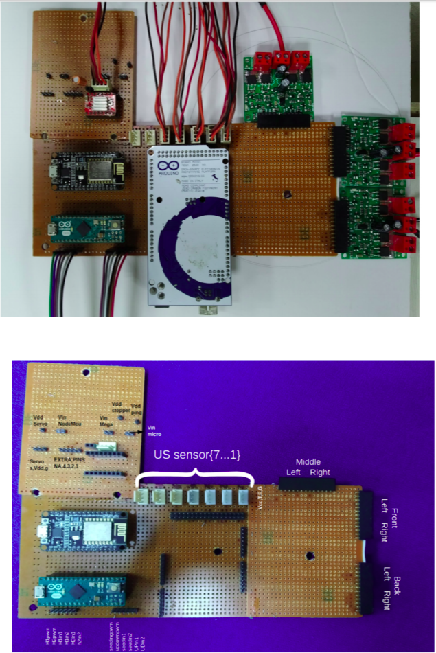
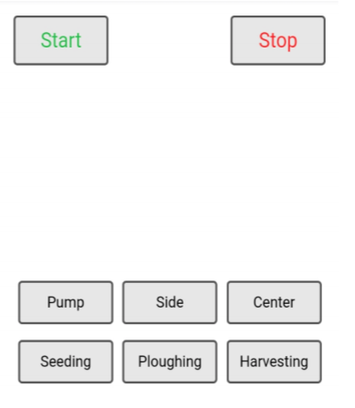
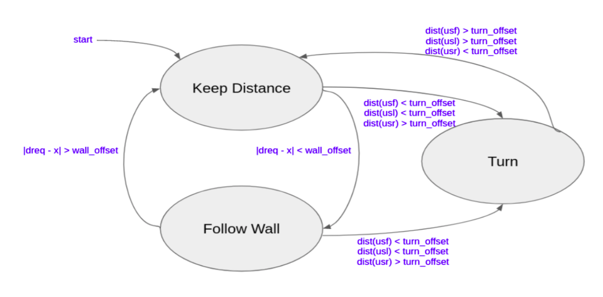
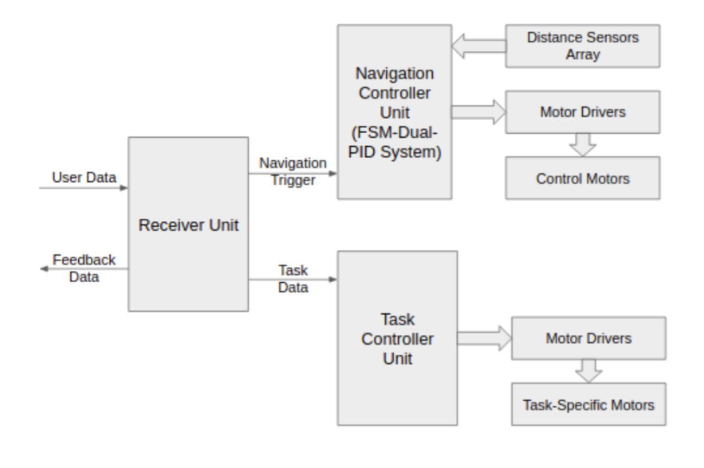
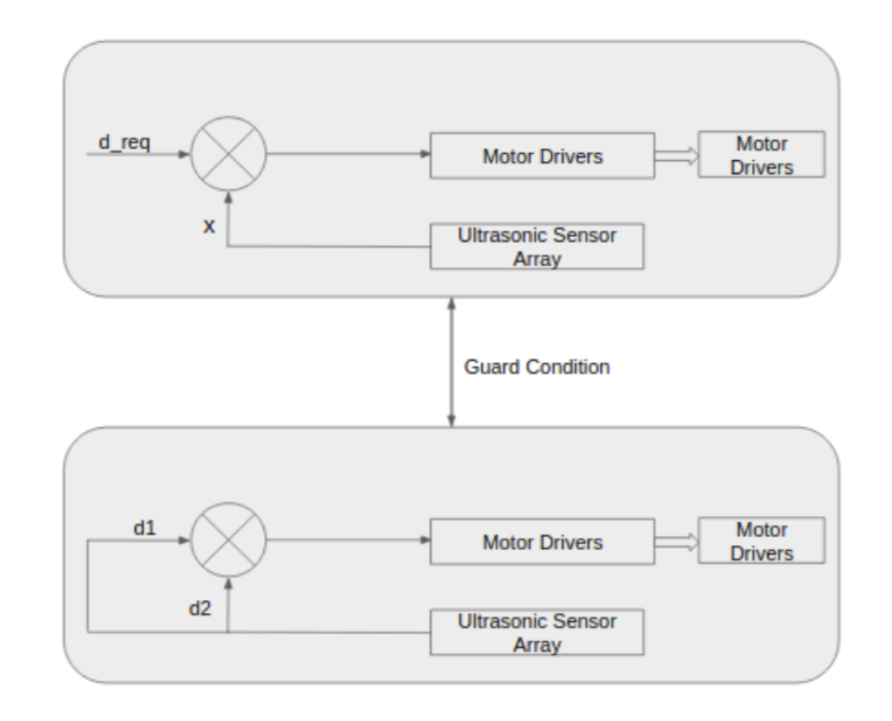
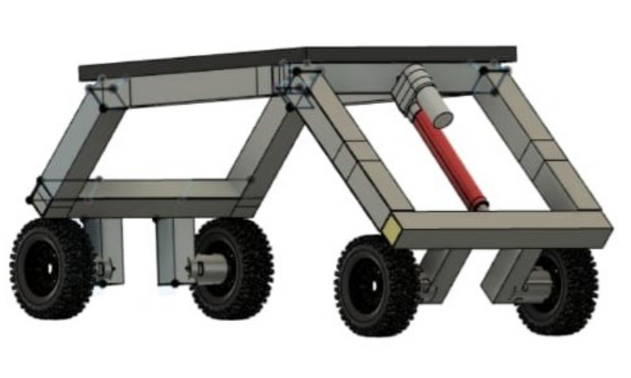
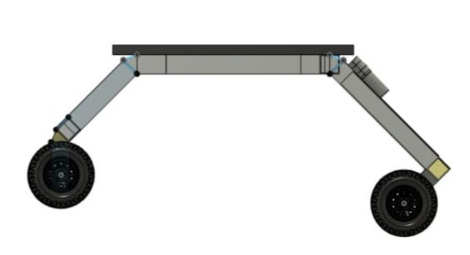

**Inter IIT Tech Meet**

**DIC Terrace Farming Challenge**

### Introduction

The trend of maximizing agricultural resources, in a sustainable manner, is positively
influencing farmers with its growing demand in the world’s food supply chain. IoT has
become a mainstream technology, driving several industries such as transportation,
manufacturing, agriculture, and others. The increasing use of precision agriculture, among
farmers, for collecting and processing data helps in making better decisions on fertilizing,
planting, and harvesting crops. 

The proliferation of IoT has revolutionized the agriculture industry that primarily depends
on technology, engineering, and physical and biological sciences. Furthermore, the
increasing labor wages and untrained labor have also propelled farmers to use a costefficient method for increasing productivity, which is likely to influence the industry growth
over the projected period. 

### ELECTRONICS

For the wireless communication of data, we have used
NodeMCU ESP8266. It helps us to communicate with
Arduino MEGA and Arduino MICRO using serial pins The
Node MCU is an open source firmware and development
kit that helps us to prototype our IoT product with
ArduinoIDE. It includes firmware which runs on the
ESP8266 Wi-Fi SoC. And hardware which is based on the
ESP-12 module. . Serial is used for communication
between the Arduino boards and NodeMCU. All ESP
boards have at least one serial port (also known as a
UART or USART): Serial. It communicates on RX and TX.
ELECTRONICS
Arduino MEGA takes care of the Autonomous Navigation
whereas Arduino MICRO controls Seeding and Harvesting.
NodeMCU creates a WiFi Hotspot. The user connects to
that WiFi using a device. Opening the dedicated IP
address, the user will see the shown window, where the
user can give the required commands. NodeMCU will then
give serial commands to the Arduinos.

### CONTROL AND NAVIGATION

The Robot’s control architecture follows a Finite State
Machine(FSM) formulation with different behaviours as
the corresponding states. The complete structure is
explained below - 

Where,

d_req → distance to be maintained from side wall

X → robot’s current distance from wall

Wall_offset → minimum error

dist(usf) → distance values from front sensor(s)

dist(usl) → distance values from left sensor(s)

dist(usr) → distance values from right sensor(s)

turn_offset → minimum distance for turning

The entire autonomous navigation system starts at the “Keep Distance” node and runs until
the robot reaches the required distance. When the guard condition is turned on, “Follow Wall”
node is switched on maintaining the wall’s curve along the entire path. The two nodes switch
between themselves to maintain the required path.

When the robot reaches the end wall i.e. front sensor provides a distance less than the given
offset, the robot switches to the “Turn” node and hence performs a ~180o rotation. The
rotation is kept in check using the sensor values and offsets. At the end of the turn it switches
back to the “Keep Distance” node and the steps repeat thereafter until it reaches the red
zone.

The “Keep Distance” node uses a Proportional Gain Controller to maintain the distance while
the “Follow Wall” node uses a Proportional-Differential Gain Controller for the wall-following
behavior. This ensures a smooth trajectory for the Robot. 

### CAD Model

### Conclusion

Thus, this bot has the potential to replace all the existing robotic systems or
those systems which still require a lot of manpower; hence change the
course of the future. Its simplicity and cost effectiveness have been its major
weapons. Limited hardware use makes it easy to handle and maintenance
free. A simple communication protocol enables the system to function
without any technical problems and also provides real time solutions. In a
broader sense, this bot can be configured and programmed to suit any
modern day system environment.

### References

http://www.tjprc.org/view_full_paper.php?id=10546&type=html

http://www.internationaljournalssrg.org/IJEEE/2018/Volume5-Issue1/IJEEE-V5I1P104.pdf

https://ieeexplore.ieee.org/document/8212756/;jsessionid=lWCrxbeAZ5z3-yqcXPLENOuAdT_u25isn8XYfKSBUTidiYejFenV!-1044746521

https://iopscience.iop.org/article/10.1088/1757-899X/325/1/012019/pdf

https://ijritcc.org/download/conferences/ICIIIME_2017/ICIIIME_2017_Track/1499063563_03-07-2017.pdfdocument/7793638

